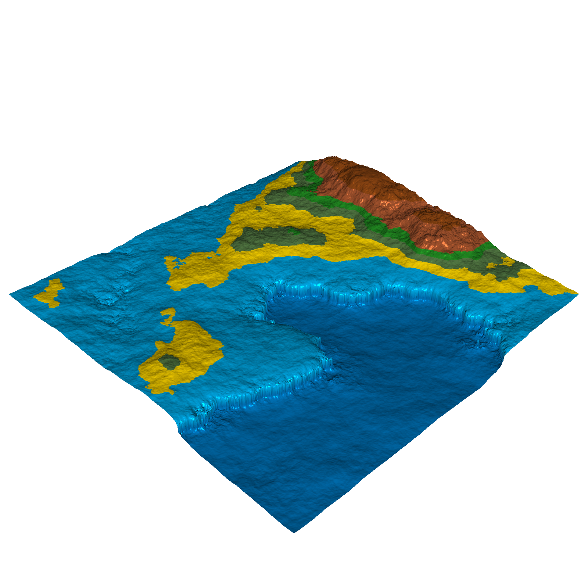
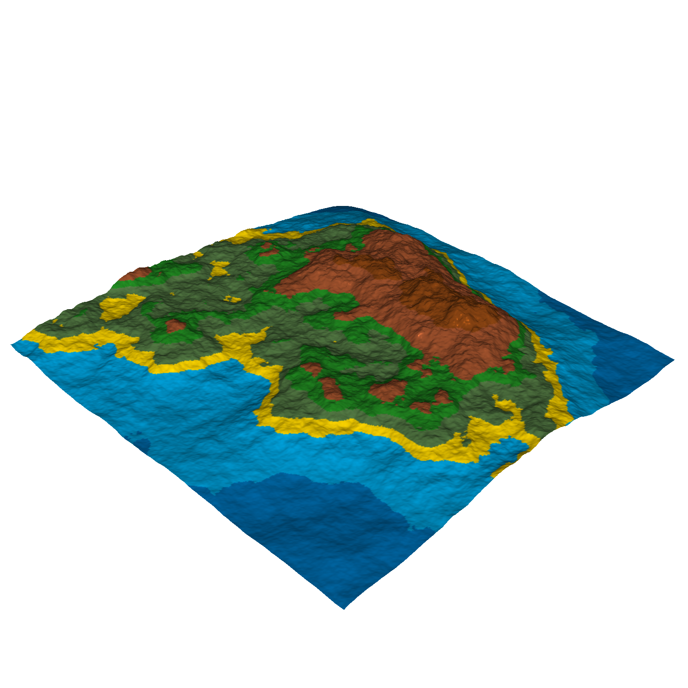
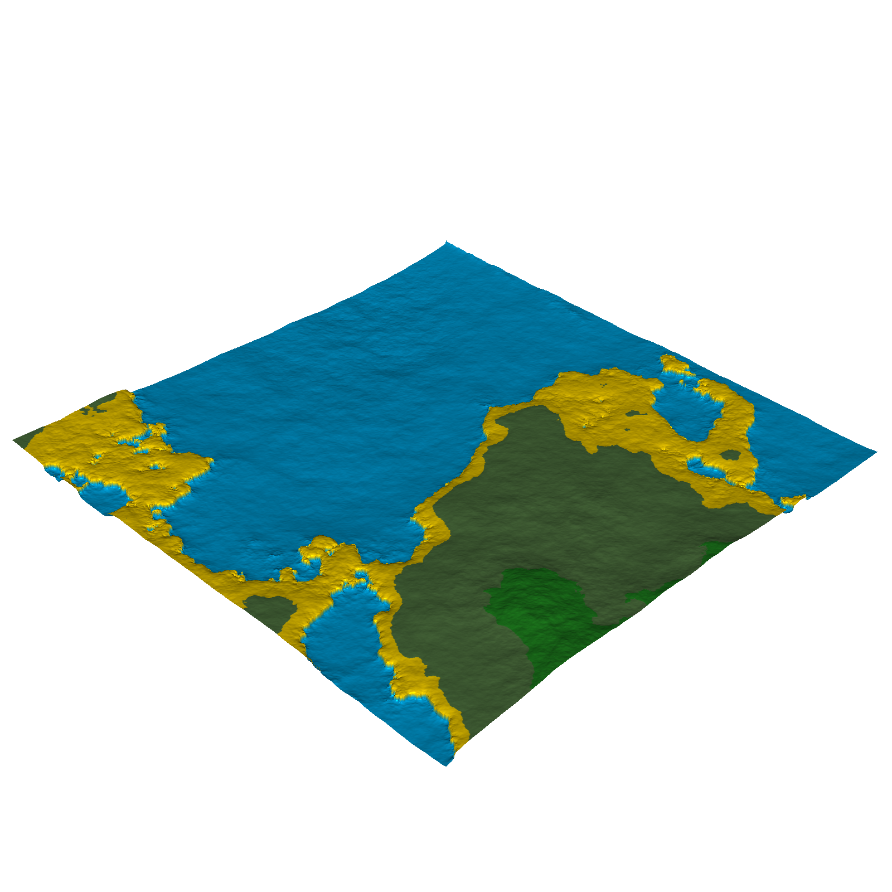

# SimpleNoiseGenerator

Un generador de terrenos 3D basado en ruido OpenSimplex con simulación de erosión hidráulica escrito en Go.



## Descripción

SimpleNoiseGenerator es una herramienta para generar terrenos 3D procedurales realistas. Utiliza el algoritmo OpenSimplex para generar mapas de altura base que luego son procesados mediante simulación de erosión hidráulica para crear características realistas como ríos, cañones y depósitos sedimentarios.

El proyecto incluye:
- Generación de terreno basada en ruido
- Simulación de erosión hidráulica
- Funciones de suavizado personalizables
- Exportación a formato PLY
- Renderizado isométrico

## Instalación

### Requisitos previos
- Go 1.16 o superior

### Pasos de instalación

1. Clona el repositorio:
   ```
   git clone https://github.com/tuusuario/SimpleNoiseGenerator.git
   cd SimpleNoiseGenerator
   ```

2. Instala las dependencias:
   ```
   go mod download
   ```

## Uso

Para generar un terreno con la configuración predeterminada:

```
go run main.go
```

El programa generará:
- Archivos PLY con las mallas 3D en la carpeta `meshes/`
- Imágenes renderizadas en la carpeta `images/`

## Evolución del terreno

El generador aplica erosión iterativa, creando terrenos cada vez más realistas:

### Ejemplo 1


### Ejemplo 2



## Configuración

Puedes modificar los siguientes parámetros en `main.go`:

```go
const (
    MapSize    = 1024     // Tamaño del mapa en píxeles
    MapScale   = 2048     // Escala del ruido
    MapHeight  = 256      // Altura máxima del terreno
    MapOctaves = 12       // Octavas para el ruido OpenSimplex
    MapSeed    = 3421     // Semilla para la generación aleatoria
)

ErosionParams := terrain.ErosionParams{
    MaxSteps:         100,     // Pasos máximos por gota
    Inertia:          0.05,    // Inercia del agua
    SedimentCapacity: 3.0,     // Capacidad de sedimentos
    ErosionRate:      0.3,     // Tasa de erosión
    DepositionRate:   0.3,     // Tasa de deposición
    EvaporationRate:  0.01,    // Tasa de evaporación
    Gravity:          9.8,     // Gravedad
    MinSlope:         0.01,    // Pendiente mínima
    CellSize:         1.0,     // Tamaño de celda
}

ErosionDropletCount := 200000  // Número de gotas para la simulación
```

## Funciones de suavizado

El proyecto incluye varias funciones para manipular la forma del terreno:

- `GreatPlains`: Crea terrenos más planos
- `Cliff`: Genera acantilados abruptos
- `Plateau`: Forma mesetas a cierta altura
- `Molone`: Crea formas montañosas específicas

Puedes combinarlas para conseguir diferentes tipos de paisaje:

```go
Smoother := func(height float64) float64 {
    height = terrain.GreatPlains(height)
    height = terrain.Plateau(height, 0.75)
    height = terrain.Molone(height, 0.8)
    return height
}
```

## Estructura del proyecto

```
├── main.go                   # Punto de entrada principal
├── images/                   # Imágenes renderizadas
├── meshes/                   # Archivos PLY generados
└── terrain/
    ├── hydraulicerosion.go   # Simulación de erosión
    ├── meshgenerator.go      # Generación de mallas 3D
    ├── opensimplex.go        # Implementación de ruido OpenSimplex
    ├── renderer.go           # Renderizado de terrenos
    └── SmoothingFunctions.go # Funciones de modificación del terreno
```

## Licencia

[MIT](LICENSE)

## Contribuir

Las contribuciones son bienvenidas. Por favor, abre un issue para discutir los cambios propuestos antes de enviar un pull request.
